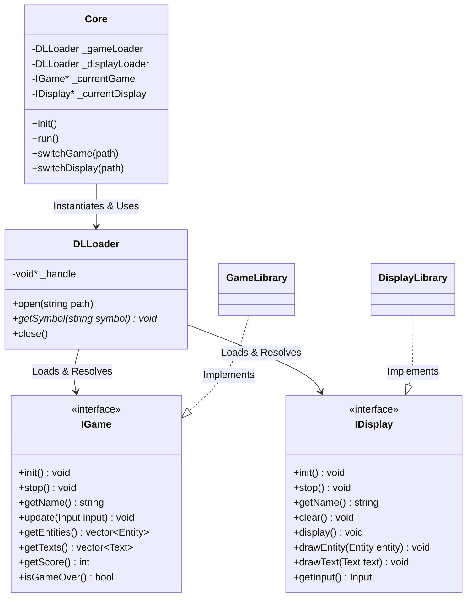

```text

 @@@@@@   @@@@@@@    @@@@@@@   @@@@@@   @@@@@@@   @@@@@@@@
@@@@@@@@  @@@@@@@@  @@@@@@@@  @@@@@@@@  @@@@@@@@  @@@@@@@@
@@!  @@@  @@!  @@@  !@@       @@!  @@@  @@!  @@@  @@!
!@!  @!@  !@!  @!@  !@!       !@!  @!@  !@!  @!@  !@!
@!@!@!@!  @!@!!@!   !@!       @!@!@!@!  @!@  !@!  @!!!:!
!!!@!!!!  !!@!@!    !!!       !!!@!!!!  !@!  !!!  !!!!!:
!!:  !!!  !!: :!!   :!!       !!:  !!!  !!:  !!!  !!:
:!:  !:!  :!:  !:!  :!:       :!:  !:!  :!:  !:!  :!:
::   :::  ::   :::   ::: :::  ::   :::   :::: ::   :: ::::
 :   : :   :   : :   :: :: :   :   : :  :: :  :   : :: ::

```

First group interface leader : jules.nourdin@epitech.eu<br>
Second group interface leader : noe.becquer@epitech.eu<br>

## Overview & How it works
The Arcade project is an extensible and modular retro-gaming platform. It is split into three main components:
- **The Core**: The main program (`./arcade`). It handles the main loop, menu, user input routing, and dynamic library loading. The Core never directly depends on any specific graphics library (no direct inclusion of ncurses, SDL2, etc.).
- **Game Modules**: Dynamic libraries (`.so`) representing individual games (e.g., Snake, Nibbler). They handle game logic, scoring, and entity updates.
- **Graphics Modules**: Dynamic libraries (`.so`) handling visual rendering and input collection (e.g., Ncurses, SDL2, SFML, LibCaca).

By loading these libraries at runtime, the project can switch games and graphical displays on the fly without recompiling!

## The Concept of Compatibility
A major goal of the Arcade project is compatibility with other groups. This is achieved via two main concepts:
1. **Shared Interfaces (`IGame.hpp` and `IDisplay.hpp`)**: We agreed on generic interfaces that define a strict contract. Any library strictly implementing these interfaces will perfectly plug into our Core program.
2. **DLLoader**: An encapsulated C++ class handling the C-style `libdl` functions (`dlopen`, `dlsym`, `dlclose`). This isolates the dynamic loading logic and guarantees safe integration of external `.so` files at runtime.

## Installation & Usage

**Dependencies for graphics libraries:**
```bash
# SDL2
sudo apt install libsdl2-dev libsdl2-ttf-dev libsdl2-image-dev

# SFML
sudo apt install libsfml-dev

# Ncurses
sudo apt install libncurses5-dev libncursesw5-dev

# LibCaca
sudo apt install libcaca-dev
```

**Compilation:**
```bash
make
```

**Running the program:**
```bash
./arcade lib/<arcade_lib_name>.so
```
*Example:* `./arcade lib/arcade_ncurses.so`

### Available Modules
**Games :**
- Snake (`arcade_snake.so`)
- Nibbler (`arcade_nibbler.so`)

**Libraries :**
- Ncurses (`arcade_ncurses.so`)
- SDL2 (`arcade_sdl2.so`)
- SFML (`arcade_sfml.so`)
- LibCaca (`arcade_libcaca.so`)

---

## Controls & Key Bindings

To ensure a seamless experience, the Arcade platform provides unified key bindings across all games and graphical libraries:

- **Arrow Keys** (`UP`, `DOWN`, `LEFT`, `RIGHT`) : Navigate the menu or move your character in-game.
- **`Enter`** : Select an option or perform an action.
- **`M`** : Go back to the main menu.
- **`R`** : Restart the current game.
- **`1`** / **`2`** : Switch to previous / next graphical library.
- **`3`** / **`4`** : Switch to previous / next game library.
- **`Q`** : Quit the Arcade platform.

---

## Documentation: How to implement new libraries

Extending the Arcade system is straightforward. You only need to create a new shared library (`.so`) that inherits from either `IGame` or `IDisplay` and exports an `entryPoint` function so the Core can instantiate it via `dlsym`.

### 1. Implementing a new Game Library
Your game class must inherit from the `IGame` interface defined in `include/IGame.hpp`.

```cpp
#include "IGame.hpp"

class MyCustomGame : public IGame {
public:
    void init() override;
    void stop() override;
    std::string getName() override;

    // Core game loop methods
    void update(Input input) override;
    std::vector<Entity> &getEntities() override;
    std::vector<Text> &getTexts() override;
    int getScore() override;
    bool isGameOver() override;
};

// EXPORT FUNCTION (Required for dlsym)
extern "C" {
    IGame *entryPoint() {
        return new MyCustomGame();
    }
}
```
Compile your game as a dynamic library object (e.g., `arcade_mygame.so`) and place it in the designated `games/` or `lib/` folder.

### 2. Implementing a new Graphics Library
Your display class must inherit from the `IDisplay` interface defined in `include/IDisplay.hpp`.

```cpp
#include "IDisplay.hpp"

class MyCustomDisplay : public IDisplay {
public:
    void init() override;
    void stop() override;
    std::string getName() override;

    // Display module methods
    void clear() override;
    void display() override;
    void drawEntity(const Entity &entity) override;
    void drawText(const Text &text) override;
    Input getInput() override;
};

// EXPORT FUNCTION (Required for dlsym)
extern "C" {
    IDisplay *entryPoint() {
        return new MyCustomDisplay();
    }
}
```
In your implementation, map your specific library's behaviors (e.g., drawing rects, handling keyboard events) to Arcade's generic `Entity`, `Text`, and `Input` structures. Compile this into a shared object (e.g., `arcade_mydisplay.so`).

---

## 3. Class Diagram & Architecture

To help you understand the architecture of our Arcade project, here is a class diagram detailing relationships between core logic, interfaces, and shared libraries.



### Explanatory Manual: How procedures are linked

- **Initialization**: When the `./arcade` binary is executed, the `Core` is initialized. The `Core` uses an instance of `DLLoader` to locate and load the default graphical library (e.g., `ncurses`) via the path provided as the first argument in the command line.
- **Dynamic Loading**: `DLLoader` wraps the `dlopen`, `dlsym`, and `dlclose` functions. It uses `dlsym` to grab the `entryPoint()` function from the loaded `.so` file. The `entryPoint()` acts as a factory, returning a pointer to the fully instantiated `IDisplay` or `IGame` object.
- **The Main Loop**: During the main loop, `Core` calls `_currentDisplay->getInput()`. It passes this input to `_currentGame->update(input)` so the game can process logic (movement, collisions, game over states).
- **Rendering Pipeline**: After updating the game logic, `Core` clears the screen with `_currentDisplay->clear()`. It then retrieves all visible elements via `_currentGame->getEntities()` and `_currentGame->getTexts()`. For each element, `Core` calls `_currentDisplay->drawEntity()` or `drawText()`, and finally calls `_currentDisplay->display()` to push the frame to the screen.
- **Switching Libraries**: When a hotkey is pressed to switch a library, the `Core` uses `DLLoader::close()` to safely unload the current `.so` file, and uses `DLLoader::open()` to instantly swap in the next requested module, maintaining a continuous game/render session without terminating.